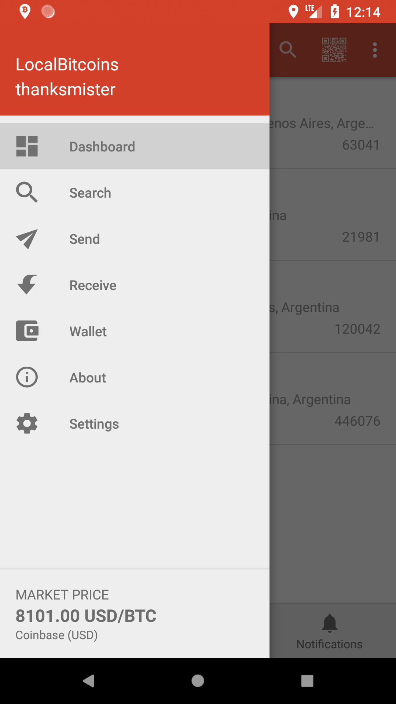
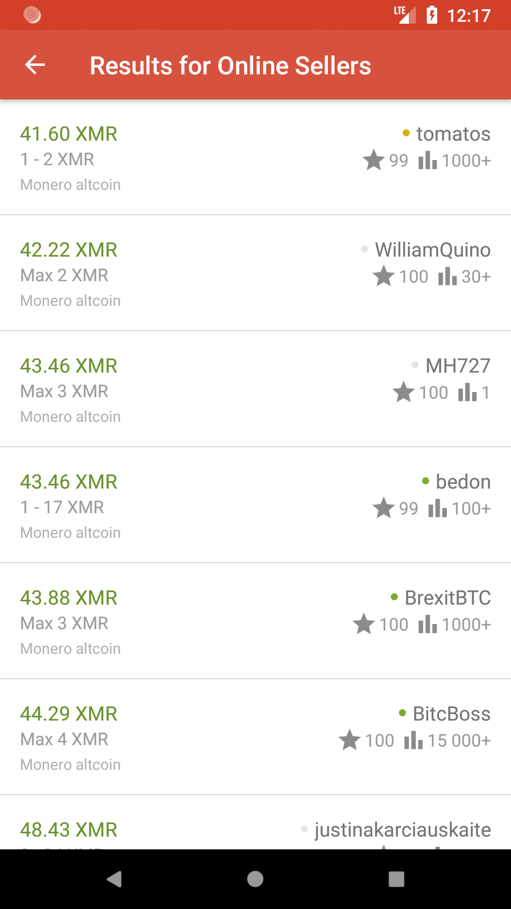

# Local Trader

Local Trader is an open source Android application for <b>[LocalBitcoins](https://localbitcoins.net/?ch=2hbo)</b>. Local Trader allows you to manage your advertisements, trades, messages, and wallet. Local Trader is available for download on the [Goolge Play Store](https://play.google.com/store/apps/details?id=com.thanksmister.bitcoin.localtrader) or you can download and install the latest file from the [release section](https://github.com/thanksmister/Local-Trader-Android/releases). 

<p>


<p>
 
A LocalBitcoins account is required to use Local Trader. To get an account, please register for at [LocalBitcoins.com](https://localbitcoins.com/register/?ch=2hbo]or) use the new mirror site at [LocalBitcoins.net](https://localbitcoins.net/register/?ch=2hbo) for blocked regions. 


If you are not familiar with LocalBitcoins, please visit their [about page](https://localbitcoins.com/about) for additional information. Also please read the [getting started guides](https://localbitcoins.com/guides/?ch=2hbo) available on LocalBitcoins to learn how to trade. As always, trade responsibly and safely.


## Features
- Ethereum, Bitcoin, Dash, Ripple, Monero, Litecoin trading
- Wallet functionality with PIN code for sending Bitcoin
- Release and fund trades with PIN code
- Send and receive trade messages and notifications of trade updates
- Send and download trade message attachments
- Update advertisements (not fully supported)
- Search local or online trades to buy or sell Bitcoin or other cryptocurrencies


## Security
Local Trader uses secure <b>Oauth2 authentication</b> for the LocalBitcoins services. 

For authentication you will be taken to the LocalBitcoins website where you will need to authenticate as you would when logging into LocalBitcoins. Upon successful authentication you will be returned to the Local Trader application.

Local Trader request permissions for read, write and money_pin during authentication. The money_pin permission allows you to send money using your <b>LocalBitcoins PIN code</b>.

You created a PIN code as part of the LocalBitcoins registration and it is required to send Bitcoin from your wallet, and to fund or release trades. The PIN code is <b>NOT</b> the same as your 2-Factor Authentication (2FA).  

View or manage your PIN code from your [profile page](https://localbitcoins.com/accounts/profile/#toc6?ch=2hbo) or use the [mirror site profile page](https://localbitcoins.net/accounts/profile/#toc6?ch=2hbo) for blocked regions.


## Permissions Explained
Location - used for searching advertisers and creating new advertisement, but only if user requests it and gives the application permission.
Write sync settings - used for background syncing data for notifications.
Authenticate accounts - used for application authority for syncing data.


## Additional Information
Local Trader is not owned or operated by LocalBitcoins. Please contact LocalBitcoins support for any account issues or questions. 

- [LocalBitcoins Registration](https://localbitcoins.com/register/?ch=2hbo)
- [LocalBitcoins Support](https://localbitcoins.com/support/request/?ch=2hbo)
- [Reddit Community](https://www.reddit.com/r/LocalTrader/)

## Build Instrucitons
To build Local Trader from code you need Android Studio 3.0 installed.  Check out the code from Github.  You need to modifiy your local.properties file to contain your own LocalBitcions API key and secret from [LocalBitcoins API page](https://localbitcoins.com/accounts/api/). Append your values to the end of the local.poperties file:

```
lbcAccessKey=[your_api_key]
lbcAccessSecret=[your_api_secret]
```

## Roadmap
- Updated architecture using RxJava 2, Room Database, Android Architecture components
- Add additional adveretisement editing features
- Add advertisement creation features

## Contributers
At this time I am looking for contributers to translate the application and Google Play listing into different languages. Please contact me if you are interested. 
